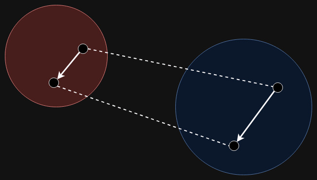

# 準同型暗号1

---

# 準同型暗号のやりたいこと
## 暗号化したまま計算したい

---

# 準同型とは？

$R$, $S$を環(ring)$^{[mr]}$とする。$f: R \rightarrow S$が

$$
\begin{align*}
&1. f(a + b) = f(a) + f(b) \\
&2. f(a \times b) = f(a) \times f(b) \\
&3. f(1_R) = 1_S
\end{align*}
$$

をみたすとき，$f$ を環の準同型 (homomorphism) という$^{[mh]}$

---

# 準同型でできること
### 構造を保ったまま違う集合内で演算

---

# 準同型暗号の基本
$Enc$ : 暗号化アルゴリズム
$M$ : 平文メッセージ
$*$ : 定義されている演算

$$
Enc(m_1) * Enc(m_2) = Enc(m_1 * m_2), \forall m_1, m_2 \in M
$$

基本的に演算は加法($+$)と乗法($\times$)を考慮する

---

# 【余談】加法と乗法の計算能力

加法(XOR)と乗算(AND)からNANDが作れる
$$
NAND(A, B) = XOR(1, AND(A, B))
$$

NANDからチューリングマシンが作れる

→ 任意の計算ができる

---

# 準同型暗号の分類

### Partially Homomorphic Encryption (PHE)
加法、乗法のどちらかができる  
例) RSA, ELGamal, Paillier

### Somewhat Homomorphic Encryption (SWHE)
加法、乗法が限られた回数できる  
例) BGN, Yao's GC, SYY

### Fully Homomorphic Encryption (FHE)
何度でも加法、乗法を適応可能  
例) TFHE, CKKS, DGHV

---

# PHEの例) RSA暗号

### 鍵生成
$p$、$q$: 大きな素数、$n = pq$、$\phi=(p-1)(q-1)$、$gcd(e, \phi) = 1$となるような$e$をとる。最後に$ed \equiv 1 (mod \ \phi)$となるように$d$をとる。

$d$: 秘密鍵  
$(n, e)$: 公開鍵

---

# PHEの例) RSA暗号
### 暗号化
$$
    c = E(m) = m^e (mod \ n)
$$

### 復号化

$$
    m = D(c) = c^d (mod \ n)
$$

---

## RSA暗号は乗法のみ

$$
\begin{align*}
    E(m_1) \times E(m_2) &= (m_1^e \ (mod \ n)) \times (m_2^e \ (mod \ n))  \\
                    &= (m_1 \times m_2)^e \ (mod \ n)  \\
                    &= E(m_1 \times m_2)
\end{align*}
$$

---

# SWHEの例) BGN暗号

TODO

## BGN暗号は2-DNFで表される演算が可能

標準形と呼ばれているもの

---

## A fully homomorphic encryption scheme (2009) $^{[gs]}$

- Craig Gentry氏の博士論文
- FHEの研究する上で重要な論文
- FHEを実現するBootstrappingという概念を導入した

---

## Bootstrappingを基礎としたFHEたち

- TFHE: Fast Fully Homomorphic Encryption over the Torus $^{[tfhe]}$
- CKKS: Homomorphic encryption for arithmetic of approximate numbers $^{[ckks]}$
- DGHV: Fully homomorphic encryption over the integers $^{[dghv]}$

---

# Learning with errors (LWE) problem
- 格子暗号の一種
- 暗号化のときにノイズを入れる
    - これが暗号解読を困難にしている
- これ単体だとSWHEだがBootstrappingを使うとFHEにできる

---

# 暗号化
$R^{k}$: k次多項式
$p, q \ (p \leq q)$: 2の累乗、$\Delta = q / p$
$\bm{A} = (A_0, ... , A_{k-1}) \in R^{k}$ : ノンス (使い捨ての値)
$\bm{S} = (S_0, ... , S_{k-1}) \in R^{k}$ : 秘密鍵
$M$: 平文、$E$: エラー

$$
    B = \langle\bm{A},\bm{S}\rangle + \Delta M + E
$$

$$
    Enc(M, S) = (\bm{A}, B)
$$
---

# 復号化
$$
    Dec(\bm{A}, \bm{S}, B) = \lfloor (\Delta M + E) / \Delta \rceil
$$

$$
    \Delta M + E = B - \langle\bm{A},\bm{S}\rangle
$$

$M$に対して$E$が小さいため、正確に復号できる  

→ $E$が大きくなると復号できなくなる

---

# Learning with errors (LWE) problem
### 加算とスカラー倍が定義できる
### LWEで加法やスカラー倍を繰り返し計算するとノイズが蓄積する
### このノイズをリセットする手段がBootstrapping

---

# 次回

### Bootstrapping操作を導入して任意の回数加法と乗法を行えるようにしたTFHEを紹介する

---

# 参考文献

[mh]: 数学の景色. 準同型写像・同型写像の定義と基本的な性質【群・環・体】. https://mathlandscape.com/homomorphism/  
[mr]: 数学の景色. 環の定義・可換環の定義とその具体例6つ. https://mathlandscape.com/ring/
[gs]: Craig Gentry. A fully homomorphic encryption scheme. Gentry2009AFH. 2009. https://api.semanticscholar.org/CorpusID:53903759

--- 

[tfhe]: Ilaria Chillotti and Nicolas Gama and Mariya Georgieva and Malika Izabach`ene. TFHE: Fast Fully Homomorphic Encryption Over the Torus.Journal of Cryptology. 2019. https://tfhe.github.io/tfhe/
[ckks]: J. H. Cheon, A. Kim, M. Kim, and Y. Song. Homomorphic encryption for arithmetic of
approximate numbers. In ASIACRYPT’17. 2017.
[dghv]: Marten Van Dijk, Craig Gentry, Shai Halevi, and Vinod Vaikuntanathan. Fully homomorphic encryp-tion over the integers. InAdvances in cryptology–EUROCRYPT. 2010.
