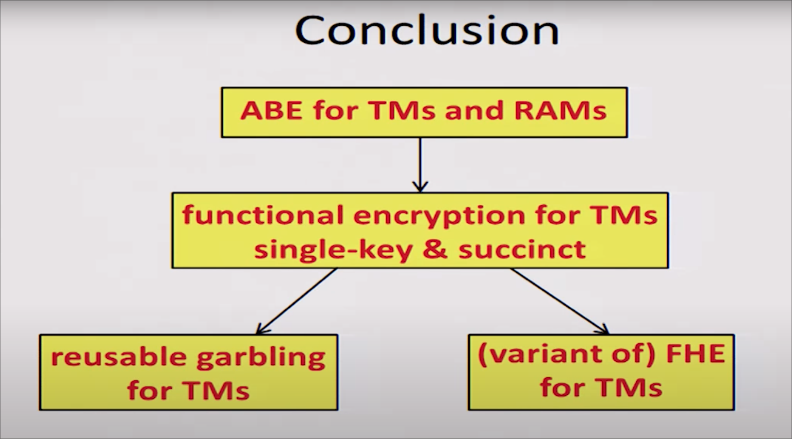
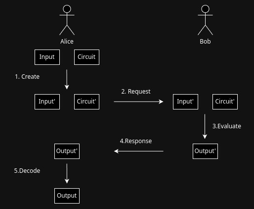
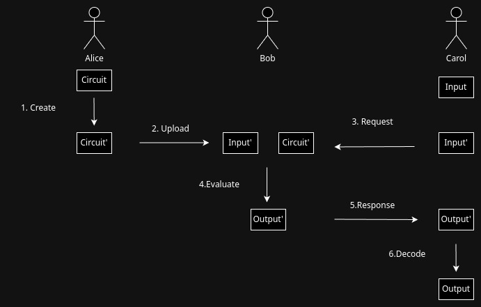

# 調査レポート2
---

# How to Run Turing Machines on Encrypted Data

- 暗号化したままTMをエミュレートしようという研究 $^{[GYP]}$

### 良い点
- 効率が良い

### 微妙な点
- 多項式時間で停止するTMしか計算できない
- めっちゃ複雑

---

# Garbled Circuit
- 様々なSecure Computingの基礎
- Aliceが回路生成者、Bobが計算者とする
- Bobは入力、回路の情報を得ることはできない
- 計算コストがCreate > Evaluate
- Garbled Circuit(C')は使いまわせない

---

## Garbled Circuitをクラウドでの計算に応用
- 回路生成者をクライアント、計算者がサーバーとする
- Garbled Circuit(C')を再利用可能にすることで計算の委託に利用できる
- 再利用可能ならば回路の作成は1回でよい (初期コスト)
- 計算コストがCreate > Evaluateなことは変らない

🤔 ……ん？

---

# そもそものモチベーション

- 計算能力の低いマシンでも計算結果が欲しい
- 初期コストを利用者がどうにかしないといけないのはおかしくない？
 → Garbled Circuitの作成は第三者にやってほしいよね

---

- 初期コストをどうにかするという視点はあまりない気がする
- Non-Interactive Verifiable Computing: Outsourcing Computation to Untrusted Workers $^{[RCB]}$
    - Garbled Circuitの作成は、信頼できるコンピュータでやる程度しか書いてない
- Whitewash: Outsourcing Garbled Circuit Generation for Mobile $^{[HCP]}$
    - 調査中……
- その他の文献でも初期コストに関するものは見掛けたことがない
    → 開拓の余地がありそう

---

## 実現するためのスキーム

---

# 参考

[GYP] Goldwasser, Shafi; Kalai, Yael Tauman; Popa, Raluca Ada; Vaikuntanathan, Vinod; Zeldovich, Nickolai. How to Run Turing Machines on Encrypted Data. CRYPTO 2013. https://www.microsoft.com/en-us/research/wp-content/uploads/2017/01/2013-tm-encrypted.pdf

[RCB] Rosario Gennaro and Craig Gentry and Bryan Parno. Non-Interactive Verifiable Computing: Outsourcing Computation to Untrusted Workers. CRYPTO 2010. https://link.springer.com/content/pdf/10.1007/978-3-642-14623-7_25.pdf

[HCP] Henry Carter, Charles Lever, and Patrick Traynor. Whitewash: outsourcing garbled circuit generation for mobile devices. In Proceedings of the 30th Annual Computer Security Applications Conference (ACSAC '14). Association for Computing Machinery, New York, NY, USA, 266–275. 2014. https://doi.org/10.1145/2664243.2664255
