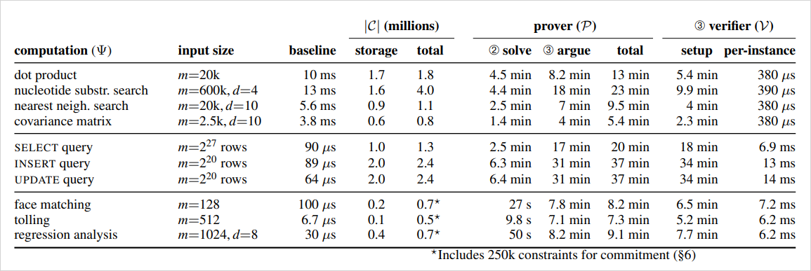
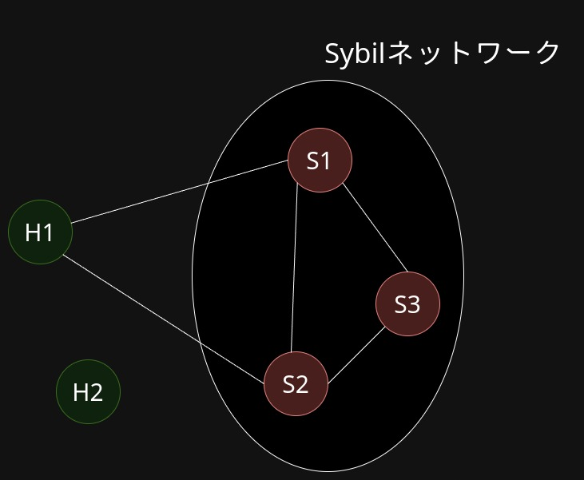
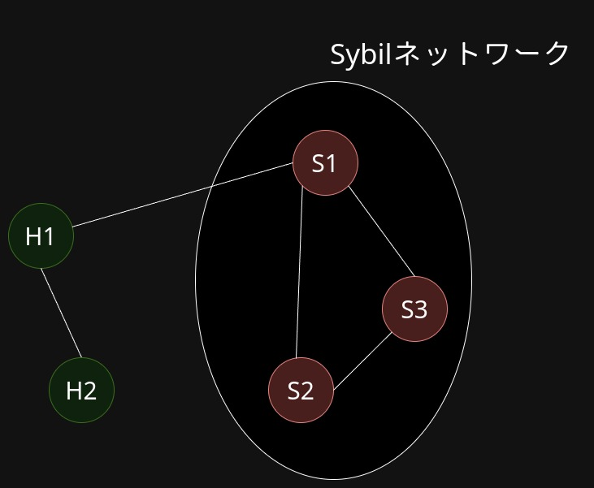

# 検証可能計算 1

---

検証可能計算を中心に研究する

なぜ？
→ データの秘匿したまま計算は利用例が難しい

- ユーザーが個々でデータを保持してる場合
→ 準同型暗号使うのが困難
- DBとしてデータを大量に保持している場合
→ 個人が特定できるカラムだけ消せばいいじゃん

---

### 検証可能計算
- サーバーに計算させた値を検証したい
    - この有意性が揺らぐことはあまりない気がする
- 完全準同型暗号よりはサーバーコストが少ないのでできることの幅が広がる（はず）
    - セットアップコストがめちゃくちゃ高いが

---

## ランダムネスを利用した検証の例：Freivalds’ Algorithm

$n \times n$の行列$A$、$B$（要素は有限体$\mathbb{F}_p$）の積$C$の検証を行う  
検証者：$\mathcal{V}$、証明者：$\mathcal{P}$

1. $\mathcal{V}$は$\mathcal{P}$に行列AとBを渡す
2. $\mathcal{P}$は$C \leftarrow A * B$を計算して$\mathcal{V}$に渡す
3. $\mathcal{V}$は長さ$N$のランダムなベクトル$v$を用意して$\mathcal{P}$に渡す
4. $\mathcal{V}$は$x \leftarrow A * B * v$を計算する
5. $\mathcal{P}$は$y \leftarrow C * v$を計算するして、$\mathcal{V}$ に返す
6. $\mathcal{V}$は$x = y$ ならば $C$を受入れ、$x \neq y$ならば否定する

---

## ランダムネスを利用した検証の例：Freivalds’ Algorithm

### 完全性
$C$が正しく計算されているならば$\mathcal{V}$は絶対にそれの証明$y$を受入れる

### 健全性
$C$が正しく計算されていないならば$\mathcal{V}$は$1 - (1 - n)/p$の確率で$y$を否定する

### 効率
愚直に行列を計算するコスト：$O(n^3)$
計算結果を検証するコスト：$O(n^2)$

---

## 現実的な計算速度か

- Freivalds’ Algorithmは行列の積しか検証できないが、任意の算術回路を検証できるアルゴリズムがある

- https://github.com/whtsht/pequin
    - 50x50の行列計算に検証一瞬、証明数秒くらい
    - コンパイルに時間がかかる → セットアップコストと呼ばれるもの

---

論文名：Verifying computations with state
著者：Benjamin Braun, Ariel J. Feldman, Zuocheng Ren, Srinath Setty, Andrew J. Blumberg, and Michael Walfish
発表場所：In Proceedings of the Twenty-Fourth ACM Symposium on Operating Systems Principles (SOSP '13)
発表年：2013年

- 算術回路はStatelessなので状態も保持できるようにする研究

---

- baselineが手元で計算した場合

---

## Multi-prover interactive proofs

論文名：Verifiable computation using multiple provers
著者：Blumberg, Andrew Justin, Justin Thaler
発表場所：IACR Cryptology
発表年：2014年

- 複数の証明者はお互いに通信できない仮定の元、効率的に計算できるプロトコルがある
- 実際にシステムできたらしい
    - 途中までしかできてないよ(;_;)とも書いてあるが……

---

## Multi-prover interactive proofs

- 複数の証明者はお互いに通信できないという仮定
    - これはかなり強い仮定
    - 理論面での研究は多い
    - そのためこれでシステムを作ろうという研究はあまりない

---

## P2Pを利用する

- 検証者は自分が接続している任意のノードを複数選び、証明者とする
- Sybil攻撃の耐性があれば、証明者はお互いに通信するのは困難と言えるのではないか
    - 言いかえると、検証者はお互いに通信できない証明者を選ぶことができる
    - 厳密に表現するのは難しそう

 

※ Sybil攻撃： IDを偽造して大量のノードが動いているかのように見せる

---

## 安全じゃない例

- S1、S2、S3は攻撃者のノード
- H1、H2は健全なノード
- H1はS1とS2を証明者として選択
- S1とS2はお互い通信して不正をすることができる

---

## 安全な例

- S1、S2、S3は攻撃者のノード
- H1、H2は健全なノード
- H1はS1とH2を証明者として選択
- S1とH2はお互い通信できない
    - Multi-prover interactive proofsの仮定を満たしている

---

## Sybil攻撃に耐性を得るには

- Sybilネットワークを分断する
    - 密に結合されたネットワークは怪しい

論文名：SybilGuard: defending against sybil attacks via social networks
著者：Yu, Haifeng and Kaminsky, Michael and Gibbons, Phillip B. and Flaxman, Abraham
発表場所 Association for Computing Machinery
発表年： 2006

---

## 学部の研究でやること
- Multi-prover interactive proofsのシステムを作って動かすのが目標

## 修士の研究でやること
- P2PでのMulti-prover interactive proofsシステムの安全性評価 
- P2Pのネットワーク上で動かすシステムを作る

---

## 参考文献

- https://people.cs.georgetown.edu/jthaler/ProofsArgsAndZK.html
    - IPからzk-SNARKsまでがまとまった大作
- http://stco.in.coocan.jp/math/takosiki/itti.pdf
    - Freivalds’ Algorithmの健全性評価は多項式の一致の定理を使っている
- https://risencrypto.github.io/Sumcheck/
    - Sum-Check Protocolと多重線形マップ
