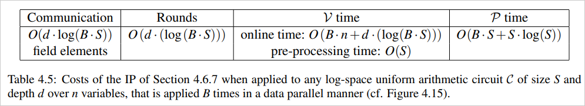

# 検証可能計算 2
# P2Pネットワーク 1

---

# 検証可能計算
- Interactive proofsとは何か
- 今やっていることの説明

---

## Interactive proof system (IPs)

$(\mathcal{V}, x, r, \mathcal{P})$
$\mathcal{V}$：検証者、$\mathcal{P}$：証明者
$r$：検証者のランダムネス
$x$：入力
$out$：$\mathcal{V}$が$\mathcal{P}$を受理する場合は1、拒否する場合は0となる関数

Completeness
$$
    \mathcal{P}r[out(\mathcal{V}, x, r, \mathcal{P}) = 1] > 2 / 3
$$

Soundness
$$
    \mathcal{P}r[out(\mathcal{V}, x, r, \mathcal{P}') = 1] \leq 1 / 3
$$

---

## なんで閾値1/3？

- ぶっちゃけ1/2未満だったらなんでもいいらしい

[気持ち]
- どのくらいの確率で正しい値を返してほしいのかはタスクによる

[理論]
- 複数回実行して多数決をとれば、高確率で正しい値を返すアルゴリズムが構成できる
    → 複数回実行というのは計算複雑性理論では無視できる

※ 厳密な議論ではない

---

## Interactive Proofの例

- 離散対数問題のある解を知っていることの証明
    - $(p,g,y)$が与えられた時 $y \equiv g^x \pmod p$となる$x$を知っている

 

1. $\mathcal{P}$は$a \leftarrow g^r \pmod p$を計算して$\mathcal{V}$に渡す
2. $\mathcal{V}$は$b \leftarrow \{0, 1\}$をランダムに選び、$\mathcal{P}$に渡す
3. $\mathcal{P}$は$c \leftarrow r+bx \pmod q$を計算して、$\mathcal{V}$に渡す
4. $\mathcal{V}$は$g^c \overset{?}{\equiv} ay^b \pmod p$を確認して、異る場合は$\mathcal{P}$を拒否する
5. 1～4を$\mathcal{V}$が納得するまで繰り返す

---

## Completenessの証明

### b = 1の場合

$g^c = g^{(r+x)} = g^rg^x = g^ry$

$ay^b = g^ry$

よって
$g^c \equiv ay^b \pmod p$

### b = 0の場合

$g^c = g^r = a$
$ay^b = a$

よって
$g^c \equiv ay^b \pmod p$

---

## Soundnessの考察

$\mathcal{P}$はbをランダムに選ぶことで成功率$\frac{1}{2}$の攻撃ができる
1. $b$、$c$をランダムに選ぶ
2. $a \leftarrow g^cy^{-b} \pmod p$を計算してプロトコル実行

$b$があっているとすると $ay^b = g^cy^{-b}y^b = g^c$となるのでテストを通過できる

 

1回繰り返すと$\mathcal{P}$が$\mathcal{V}$を騙せる確率は$\frac{1}{2}^{1} = 50\%$
20回繰り返すと$\mathcal{P}$が$\mathcal{V}$を騙せる確率は$\frac{1}{2}^{20} = 0.0001\%$

#### 十分な回数繰り返せば、不正な$\mathcal{P}$が受理される確率は指数関数的に減少する

---

## 今なにやってんの？
- GKR Protocolの理解、実装
    - 証明者は1人 Uni-prover interactive proofs （UIPs）
    - 任意の算術回路を計算結果を検証する

※  UIPsは一般的な呼びかたではないが、MIPsと対比してそう呼ぶことにする

---

# P2Pネットワーク
- P2Pネットワークの分類
- P2Pネットワークへの攻撃方法 （Eclipse攻撃）

---

## P2Pネットワークの分類

#### 構造化ネットワーク
- 接続のルールを固定することでネットワークの構造をある程度限定するもの
- DHT （分散ハッシュテーブル）
    - ハッシュ値が隣合うものとN個離れているものは接続を確保するなどのルールがある
- Hybrid P2P
    - 接続を管理する中央サーバーが存在する

#### 非構造化ネットワーク
- 接続のルールが固定されておらず、ネットワークの構造を予測しにくい
- ゴシップ（噂話し）プロトコル
    - 接続されているピアにマルチキャストして情報を伝達する

---

### MIPsの仮定
- 複数の証明者はお互いに通信できない
→ ピアの接続スロットを独占されない

- ピアの接続スロット
接続されているピアのリスト

### ピアの接続スロットを占拠する攻撃
- Eclipse攻撃
- これを防ぐ

---

## Sybil攻撃 vs Eclipse攻撃
- 共通点
    - IDを偽造して1つのコンピュータで大量のノードを動かしているように見せる

- 相違点
    - Sybil攻撃：ノード全体における仮定を壊す
        - 例) ノードの2/3はhonestなノードである
    - Eclipse攻撃：あるノードを決め打ちして通信経路を断ち、不正を行う

※ IDEのEclipseは関係ないよ！

---

## ピアの接続スロット
以下の2種類にわけられる
- インバウンドピアスロット
    - 接続要求を受け入れたピアのリスト
- アウトバウンドピアスロット
    - 自分から接続を試みたピアのリスト

---

## Eclipse攻撃 1
インバウンドピアを埋め尽くす
- 攻撃者：ひたすら接続要求する
- アウトバウンドピアを埋め尽すと比較して、対策は簡単という印象

 

論文名：Eclipse Attacks on Bitcoin’s Peer-to-Peer Network
著者：Ethan Heilman and Alison Kendler
発表場所：USENIX Security Symposium
発表年：2015年

---

## Eclipse攻撃 2
アウトバウンドピアを埋め尽す
- 攻撃者：ピアが接続するであろうIDのピアの事前に生成する
- 構造化されたネットワークで実現できる

 

論文名：Low-Resource Eclipse Attacks on Ethereum's Peer-to-Peer Network
著者：Yuval Marcus and Ethan Heilman and Sharon Goldberg
発表場所：IACR Cryptol
発表年：2018年
