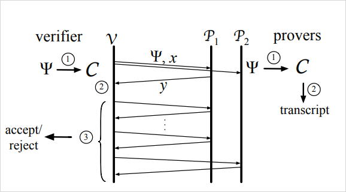

# 検証可能計算 3

---

# 論文タイトル（仮）

### 複数証明者を仮定したレイテンシの高い検証可能計算システムの設計

---

# 背景
- 検証可能計算の既存の研究
    - 検証時間の削減はかなり成功している
    - 証明時間がとんでもなく時間がかかる

- 時間がかかっても証明したい命題（ステートメント）がある場合はそれでも良い
    - ZK-Rollups
        - ブロックチェーン上で行っていた計算をローカルで計算できるようにする

---

- 私がやりたいのは計算の委託！！

 

- 計算の委託をしたい場合、証明時間がかかりすぎるのは問題
    - 自分で計算したほうが早かったら頼みたくない

- 証明時間をなんとか短かくしたい

---

# 目標

$\mathcal{V}$：検証者、$\mathcal{P}$：証明者

 

$\mathcal{V}$の検証コスト < $\mathcal{V}$の計算コスト
$\mathcal{P}$に計算委託したときのレイテンシ < $\mathcal{V}$の計算時間 
↑ これに挑戦することが大切だと思う

 

※ ネットワーク通信の時間は（そこまで）考慮しないとする

---

# 方法、アイディア
- 複数の証明者を利用して計算と証明を平行に実行する

### 欠点
- 誰が不正をしようとしたのかよくわからない

---

## Sum-check protocol

- めっちゃ適当な解説

1. 検証者が乱数を証明者に送る
2. 証明者は検証者にある多項式を送る
3. 検証者は多項式を送った乱数を使い検証
4. 1~3を再帰的に繰り返す

 

- 詳しいプロトコルは[Proofs, Arguments, and Zero-Knowledge](https://people.cs.georgetown.edu/jthaler/ProofsArgsAndZK.pdf)
- ※ checksumとは直接的な関係はないです
    - 似ている部分はある

---

## Sum-check protocolを複数の証明者に適用

- 実は2倍までしか高速化しない

---

## GKR protocol 

- NCクラスの計算の計算結果を検証する
    - NCクラス： Uniform Boolean circuitで計算できるもの
        - 整数の四則演算など
        - 特定ビット列のカウント
        - 行列演算など
- 回路を層にわけて層ごとにSum-check protocolを実行する
- GPUで高速化する研究が既にあったりする
    - Verifiable Computation with Massively Parallel Interactive Proofs (2012)

---

## GKR protocolを複数の証明者に適用

- 左：証明者1人のみ、右：証明者が3人いる
- 深さが低いかつ幅が広い回路に有効そう

---

## Q.これらが前回言ってたMulti-proverなんたらってやつ？

## A. 違います

---

## Multi-prover interactive proofs system (MIPs)

- もう1人の証明者が検証者の計算を一部肩代りするイメージ
- 証明時間そんなに変らないので今回のケースにあまり合っていない

---

## 今後

- 複雑なプロトコルで複数証明者が適応可能か調べる
- 複数証明者の安全性の考察
